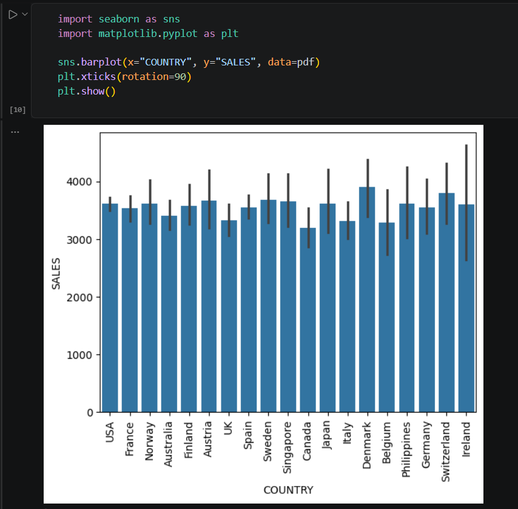
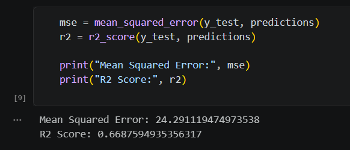
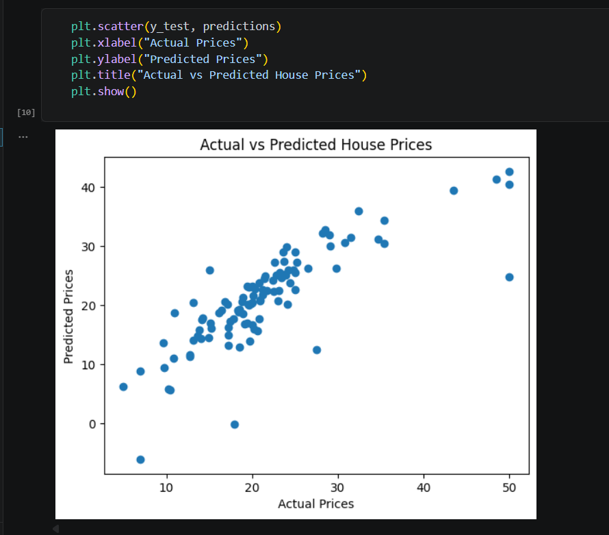
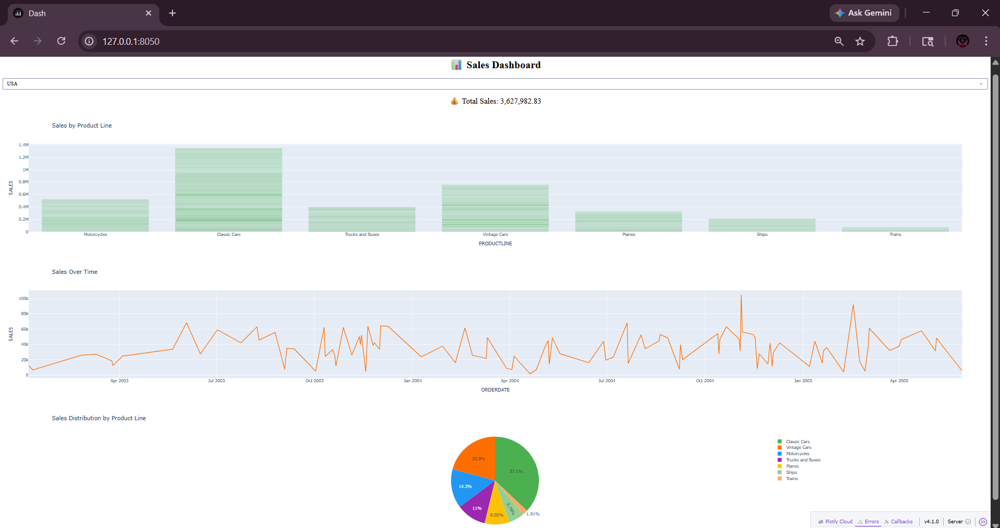
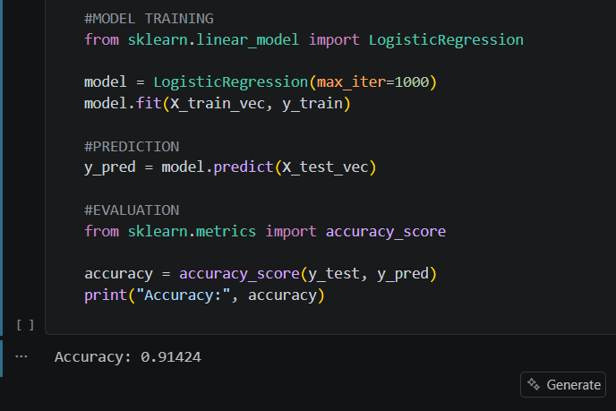
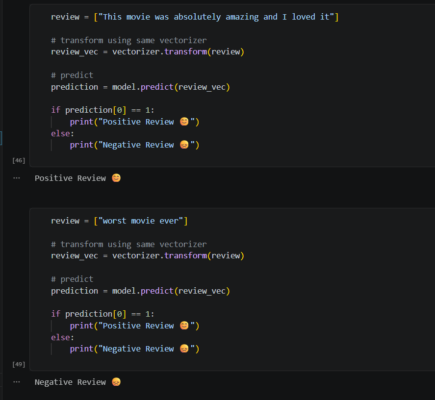

# Data Analytics Internship Project

## Name
Yamuna V

---

## Project Overview
This project consists of four major tasks completed during the Data Analytics Internship. It demonstrates skills in data analysis, machine learning, and dashboard development using real-world datasets.

---

## Tasks Completed

### 🔹 Task 1: Exploratory Data Analysis (EDA)
- Performed data cleaning and preprocessing
- Analyzed dataset using statistical methods
- Created visualizations for better understanding

### 🔹 Task 2: House Price Prediction
- Built a regression model for price prediction
- Evaluated model using MSE and R² score
- Compared actual vs predicted values

### 🔹 Task 3: Sales Dashboard
- Developed an interactive dashboard using Plotly & Dash
- Visualized sales trends and product performance

### 🔹 Task 4: Sentiment Analysis
- Preprocessed text using TF-IDF
- Built Logistic Regression model
- Achieved ~91% accuracy

---

## 📊 ScreenShots

### 📌 Task 1: Sales Distribution

Description: This bar chart shows sales across different countries. It helps compare    
performance and identify which countries have higher or lower sales.
---

### 📌 Task 2: Model Evaluation

Description: This output shows the performance of the regression model using Mean Squared 
Error (MSE) and R² score. The MSE indicates the prediction error, while the R² score represents 
how well the model explains the data. 
---

### 📌 Task 2: Actual vs Predicted Prices

Description: This scatter plot compares actual house prices with predicted values from the 
model. The closer the points are to a straight line, the better the model’s predictions, indicating 
good accuracy.
---

### 📌 Task 3: Sales Dashboard

Description: This dashboard displays sales insights using interactive visualizations, including 
bar, line, and pie charts. It allows users to analyze sales by product line, track sales over time, 
and view distribution across categories. 

---

### 📌 Task 4: Model Training & Accuracy

Description: This output shows the training and evaluation of the Logistic Regression model 
for sentiment analysis. The model is trained on text data and achieves an accuracy of 
approximately 91%, indicating good performance in classification.

---

### 📌 Task 4: Sentiment Prediction

Description: This output demonstrates the model predicting sentiment for new text inputs. The 
model correctly classifies a positive review and a negative review, showing its effectiveness in 
real-time sentiment prediction.
---

## Technologies Used
- Python
- Pandas
- NumPy
- Matplotlib
- Seaborn
- Scikit-learn
- Plotly & Dash

---

## Conclusion
This internship provided practical exposure to real-world data analysis and machine learning applications. It helped in developing strong skills in data preprocessing, visualization, and predictive modeling. The project improved problem-solving abilities and confidence in handling real datasets.

---

## References
- Scikit-learn Documentation  
- Pandas Documentation  
- Plotly & Dash Documentation  
- Online tutorials and research papers  
